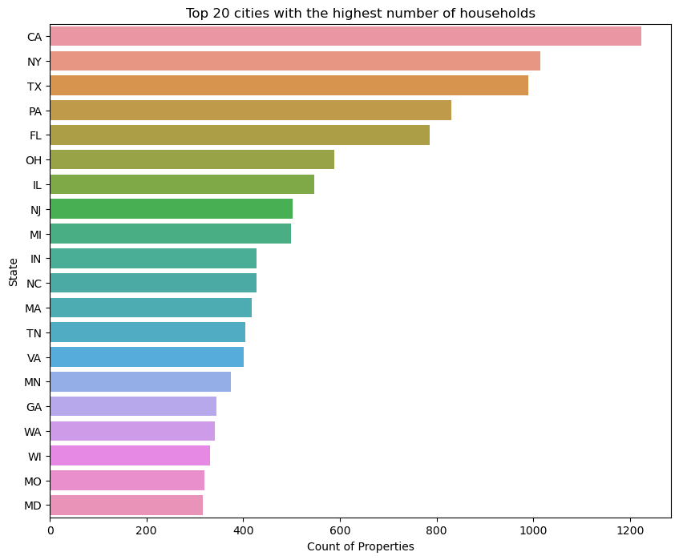
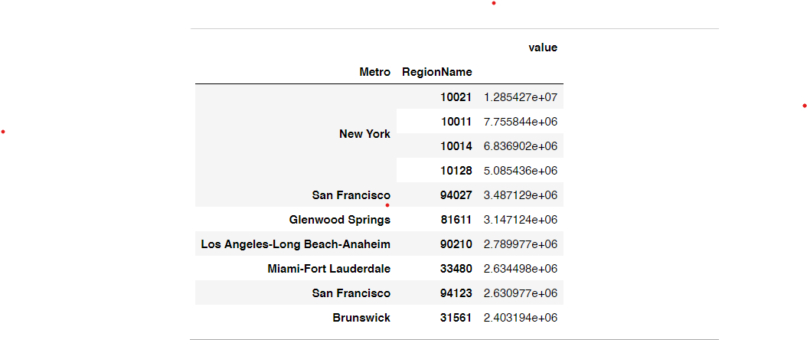
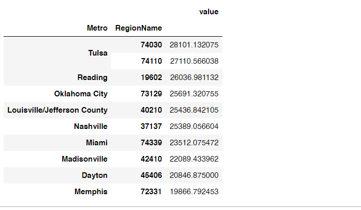
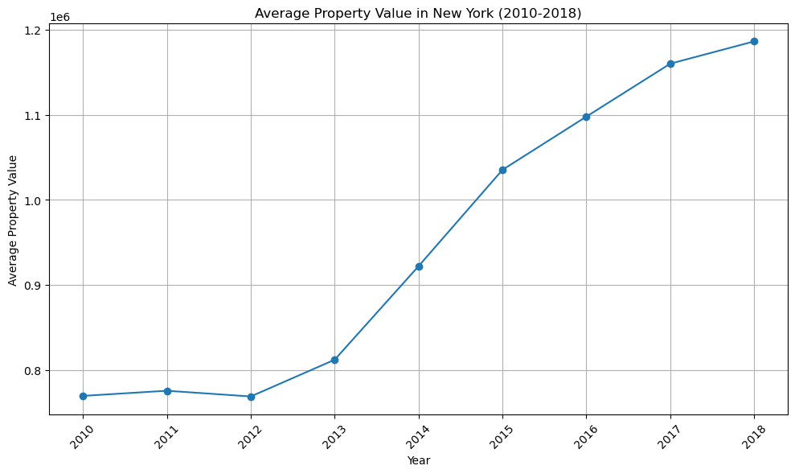
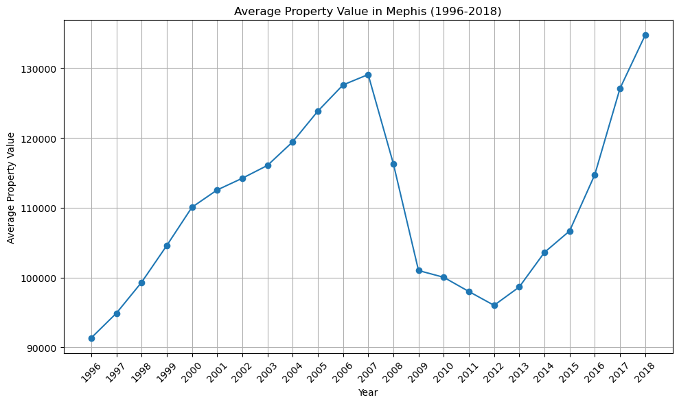

# House Price Forecasting using Zillow Housing dataset

**Authors:** 
[Clara Gatambia](https://github.com/claragatambia)
[Rhoda Musyoki](https://github.com/Rhod-sy/)
[Lewis Gitari](https://github.com/GitariLewis)
[Esther Nyaikuba](nyaikuba.esther@gmail.com)
[Mark Kuria](kuriamark@gmail.com)


## Overview

Predicting real estate market trends accurately is crucial for investors, developers, real estate agencies and homeowners to make well-informed decisions regarding property investments, pricing, location, and market timing. With numerous factors such as economic conditions, location, demographics, interest rates, and seasonal variations influencing the dynamic real estate market in the USA, this task can be challenging. To address this, we aim to develop a predictive time series model to identify the top five preferred zip codes.

## Business Problem

Tatu real-estate investment firm seeks to identify the top five zip codes for investment opportunities in the US. This requires analyzing historical data and utilizing time series forecasting techniques to predict future property values, rental yields, and market dynamics. By leveraging advanced analytical models, we aim to provide Tatu with actionable insights into potential growth trajectories, enabling informed decision-making and strategic allocation of resources for optimal investment outcomes.

*** Questions to consider:***
1. Visualize the impact of the 2008 recession on the housing market per ZipCode
2. Investigate and identify the top 5 ZipCodes for consistent good Return on Investment (ROI)
3. Visualize the appreciation of the real estate industry in high population ZipCodes
4. Build a time series regression model to predict average house prices in the US

## Data 

Zillow’s Economic Research Team collects, cleans and publishes housing and economic data from a variety of public and proprietary sources.The large majority of Zillow’s aggregated housing market and economic data is made available for free download at zillow.com/data. 

The dataset used for this project is however provided in this project's repo - time-series/zillow_data.csv 


## Statistical Methods

Time Series Modelling with SARIMA


## Data Preprocessing & EDA

To prepare the dataset for modelling, the following processes were done

- The dataset provided was in "wide format" and for our time series models to run, we converted it to "long format"
- The time series columns were converted to 'datetime' data type  
- To aid in our analysis and modelling, feature engineering was done. We added 1 key column to our dataset i.e. ROI

Conclusions made based on EDA:

1. California Metro has the highest number of properties listed


2. ZipCodes 10021, 10011, 10014 and 10128 were among the top priced regions, which apparently were among the Zipcodes less affected by the   
   2008 financial crisis


3. Memphis had the lowest valuable property listed


4. Property pre-categorized among the high value ZipCodes were not greatly affected by the market crisis unlike the drop in value observed  
   post crisis in the low value ZipCodes

5. Post-crisis growth rate is still positive for the high value ZipCodes despite seeing growth rates even went into negatives for some 
   metro areas


## Modelling

We sought to build a model to predict the house prices for the ZipCodes which are high priced and have good prospects for a good ROI. We chose ZipCode as a baseline as it is the lowest geographic presentation level in our data. To streamline the forecasting process, we focused solely on the 30 highest priced zip codes.

Workflow:

1. Data Transformation
2. Data Resampling
3. Baseline Model
4. Arima Models
5. Facebook Prophet

 ## Conclusion
 
1. Top 5 ZipCodes with the highest profit margins (ROI) are:
** 
- 10021 (NewYork)
- 10011 (NewYork)
- 10014 (NewYork)
- 90210 (Beverly Hills)
- 94027 (Atherton) **

All these ZipCodes are in the top 10 list of ZipCodes with highest priced properties. 

2. The 2007 global financial crisis had a severe effect on low value zipcodes - 11217, 90049, 94022 and 94301

3. The forecasting model had a R2 score of 74% for forecasting average house values per month. The second model had an accuracy score of  73.66% on the forecasting of house prices for the ZipCodes with high house prices.

4. The metropolitan areas showing higher growth rates are Gleenwood Springs at 200% followed by Brunswick and Panama at 225% and 75% respectively. The ZipCodes with high growth rates are 27980(2.5%), 30032(2%), 80216(1.75%) and 89030(1.5%).

The following are therefore the top 5 best ZipCodes to invest in:
** 10021, 10011, 10014, 90210 and 94027 **


## What Next?


## For More Information

See the full analysis in the [Project Jupyter Notebook](./DSC-PHASE4-PROJECT.ipynb) 

## Repository Structure

```
├── Images
├── Data
├── DSC-PHASE4-PROJECT.ipynb
├── DSC-Phase4-Project-Presentation.pdf
└── README.md
```
